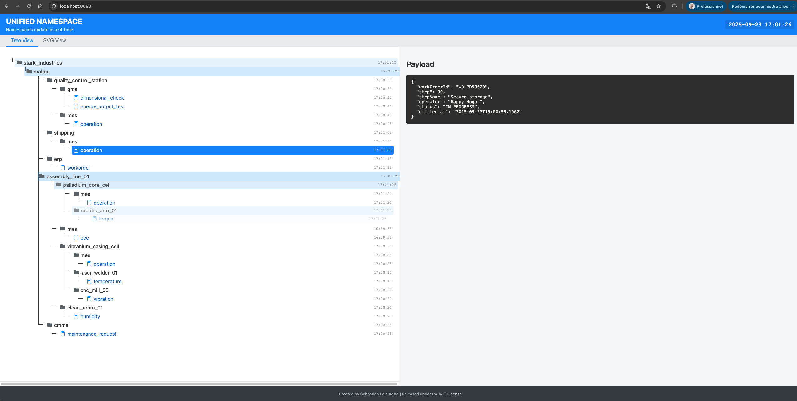

# Real-Time MQTT & Unified Namespace Web Visualizer

A lightweight, real-time web application to visualize MQTT topic trees and dynamic SVG graphics based on Unified Namespace (UNS) messages. This project includes a powerful data simulator and a dedicated **Model Context Protocol (MCP) Server** for seamless integration with AI agents.



---

## Core Features

-   **Real-Time Topic Tree:** Automatically builds and displays a hierarchical tree of all received MQTT topics.
-   **Dynamic SVG View:** Updates a custom 2D plan (SVG) in real-time based on incoming MQTT data, mapping topics and payloads to visual elements.
-   **AI Agent Integration:** A dedicated **MCP Server** exposes application controls and data as structured tools for Large Language Model (LLM) agents.
-   **Built-in UNS Simulator:** Generates a realistic manufacturing data stream that can be controlled via the UI or API.
-   **Persistent Message History:** Stores all MQTT messages in a local **DuckDB** database for historical analysis and querying.
-   **Live Data & History Views:** Browse the latest payload for any topic, or review chronological message history in a dedicated view.
-   **Secure & Broker-Agnostic:** Connects to any standard MQTT broker and supports secure connections (MQTTS, MTLS) for brokers like AWS IoT Core.
-   **Sparkplug B Support:** Optionally decodes binary Sparkplug B Protobuf payloads into JSON for visualization.

---

## Architecture

The application runs as a two-process system for maximum flexibility and security.

**1. Web Server (`server.js`):** The core application.
    -   Connects to the MQTT broker.
    -   Serves the frontend web application (HTML, CSS, JS).
    -   Broadcasts MQTT messages to the UI via WebSockets.
    -   Stores data in a DuckDB database.
    -   Exposes a secure, **localhost-only REST API** for internal control.

**2. MCP Server (`mcp_server.js`):** The AI Agent interface.
    -   Uses the `@modelcontextprotocol/sdk` to define structured tools for an LLM.
    -   Communicates with the Web Server via its internal REST API.
    -   Provides a safe and controlled environment for AI agents to interact with the application's data and simulator.

**Data Flow:**

`AI Agent -> MCP Server -> Web Server REST API -> MQTT Broker / Database`

`MQTT Broker -> Web Server -> WebSocket -> Web UI`

---

## Tech Stack

-   **Backend:** Node.js, Express, `ws` (WebSockets), `mqtt`, DuckDB
-   **AI Interface:** `@modelcontextprotocol/sdk`, `zod`, `axios`
-   **Frontend:** Vanilla JavaScript (ES6+), HTML5, CSS3

---

## Getting Started

### Prerequisites

-   Node.js (v16 or higher recommended).
-   An MQTT broker (or use the built-in simulator).
-   For secure brokers (e.g., AWS IoT), you will need your client certificate, private key, and a Root CA certificate.

### Installation

1.  **Clone the Repository:**
    ```bash
    git clone [https://github.com/slalaure/mqtt_uns_viewer.git](https://github.com/slalaure/mqtt_uns_viewer.git)
    cd mqtt_uns_viewer
    ```

2.  **Install Dependencies:**
    ```bash
    npm install
    ```

3.  **Configure Environment Variables:**
    -   Copy `.env.example` to a new file named `.env`.
    -   Open `.env` and fill in your MQTT broker details. For local testing with the simulator, the default values are often sufficient.

4.  **(Optional) Add Certificates:**
    -   If connecting to a broker requiring MTLS, create a `certs` folder in the root of the project.
    -   Place your credential files (e.g., `certificate.pem.crt`, `private.pem.key`, etc.) inside this `certs` folder and update their names in `.env`.

---

## How to Run

You need to run two separate processes in two different terminals.

### 1. Start the Main Web Server

This server handles the MQTT connection and the user interface.

```bash
# In your first terminal:
node server.js
```
The application will be available at http://localhost:8080.

2. Start the MCP Server for AI Agents
This server exposes the tools for your LLM agent.

# In your second terminal:

```bash
node mcp_server.js
```

This server will connect to the main application and listen for instructions from your agent framework.

---

## API & Integration

### Model Context Protocol (MCP) Server

Connect your AI agent framework to the `mcp_server.js` process. The following tools are available:

| Tool Name                  | Description                                                                                          | Parameters                                                                                             |
| -------------------------- | ---------------------------------------------------------------------------------------------------- | ------------------------------------------------------------------------------------------------------ |
| `start_simulator`          | Starts the MQTT data simulator.                                                                      | _None_                                                                                                 |
| `stop_simulator`           | Stops the MQTT data simulator.                                                                       | _None_                                                                                                 |
| `get_simulator_status`     | Gets the current status of the simulator (`running` or `stopped`).                                    | _None_                                                                                                 |
| `get_application_status`   | Provides a high-level overview of the application's status (MQTT connection, DB stats).              | _None_                                                                                                 |
| `list_all_topics`          | Returns a flat list of all unique MQTT topics known to the application.                               | _None_                                                                                                 |
| `get_latest_message`       | Retrieves the most recent message for a single, specified MQTT topic.                                  | `topic` (string): The full MQTT topic name.                                                            |
| `get_topic_history`        | Retrieves recent historical messages for a specified topic.                                           | `topic` (string): The full MQTT topic name.<br>`limit` (number, optional): Max messages to return.     |

### Internal REST API (Localhost-Only)

The MCP server communicates with the main server via this REST API. It is secured to only accept requests from `localhost`.

- `POST /api/simulator/start`
- `POST /api/simulator/stop`
- `GET /api/simulator/status`
- `GET /api/context/status`
- `GET /api/context/topics`
- `GET /api/context/tree`
- `GET /api/context/topic/:topic(.*)`
- `GET /api/context/history/:topic(.*)`

---

### License
This project is licensed under the MIT License. See the LICENSE file for details.
