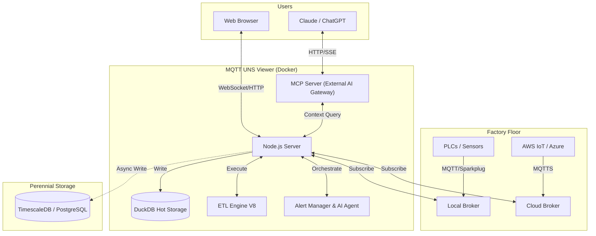

# MQTT UNS Viewer

<div align="center">


**The Open-Source Unified Namespace Explorer for the AI Era**

[Live Demo](https://www.mqttunsviewer.com) • [Architecture](#-architecture--design) • [Installation](#-installation--deployment) • [User Manual / Wiki](#-user-manual--power-user-wiki) • [Developer Guide](#-developer-guide) • [API](#-api-reference)

</div>

---

### 📺 Watch the Demo

[](https://youtu.be/aOudy4su9F0)

---

## 📖 The Vision: Why UNS? Why Now?

### The Unified Namespace (UNS) Concept
The **Unified Namespace** is the single source of truth for your industrial data. It creates a semantic hierarchy (e.g., `Enterprise/Site/Area/Line/Cell`) where every smart device, software, and sensor publishes its state in real-time.

* **Single Source of Truth:** No more point-to-point spaghetti integrations.
* **Event-Driven:** Real-time data flows instead of batch processing.
* **Open Architecture:** Based on lightweight, open standards (MQTT, Sparkplug B).

> 📚 **Learn More:**
> * [What is UNS? (HiveMQ Blog)](https://www.hivemq.com/blog/unified-namespace-iiot-architecture/)
> * [Walker Reynolds on UNS (YouTube)](https://www.youtube.com/watch?v=6xHpw9YBYIQ)

### The AI Revolution & Gradual Adoption
In the age of **Generative AI** and **Large Language Models (LLMs)**, context is king. An AI cannot optimize a factory if the data is locked in silos with obscure names like `PLC_1_Tag_404`.

**MQTT UNS Viewer** facilitates **Gradual Adoption**:
1.  **Connect** to your existing messy brokers.
2.  **Visualize** the chaos.
3.  **Structure** it using the built-in **Mapper (ETL)** to normalize data into a clean UNS structure without changing the PLC code.
4.  **Analyze** with the **Autonomous AI Agent** which monitors alerts, investigates root causes using available tools, and generates reports automatically.

---

## 🏗 Architecture & Design

This application is designed for **Edge Deployment** (on-premise servers, industrial PCs). It prioritizes low latency, low footprint, high versatility, and extreme resilience against data storms.

### Component Diagram



### Storage & Resilience Strategy
To handle environments ranging from a few updates a minute to thousands of messages per second, the architecture uses a multi-tiered and highly resilient approach:

1.  **Extreme Resilience Layer (Anti-Spam & Backpressure):**
    * **Smart Namespace Rate Limiting:** Drops high-frequency spam (>50 msgs/s per namespace) early at the MQTT handler level, protecting CPU/RAM while preserving low-frequency critical events.
    * **Queue Compaction:** Deduplicates topic states in memory before DuckDB insertion to prevent Out-Of-Memory (OOM) errors during packet storms.
    * **Frontend Backpressure:** Uses `requestAnimationFrame` to batch DOM updates, ensuring the browser UI never freezes, even under extreme load.
2.  **Tier 1: In-Memory (Real-Time):** Instant WebSocket broadcasting for live dashboards.
3.  **Tier 2: Embedded OLAP (DuckDB):** * Stores "Hot Data" locally.
    * Time-series aggregations via native `time_bucket` functions.
    * Auto-pruning prevents disk overflow (`DUCKDB_MAX_SIZE_MB`).
4.  **Tier 3: Perennial (TimescaleDB):**
    * Optional connector.
    * "Fire-and-forget" batched ingestion for long-term archival and compliance.

---

## 🐳 Installation & Deployment

### Prerequisites
* Docker & Docker Compose
* Access to MQTT Broker(s)

### 1. Quick Start
```bash
# Clone the repository
git clone https://github.com/slalaure/mqtt_uns_viewer.git
cd mqtt_uns_viewer

# Setup configuration
cp .env.example .env

# Start the stack (Multi-Arch image available on Docker Hub)
docker-compose up -d
```
* **Dashboard:** `http://localhost:8080`
* **MCP Endpoint:** `http://localhost:3000/mcp`

### 2. Configuration (`.env`)

The application supports extensive configuration via environment variables.

#### Connectivity & Permissions
Define multiple brokers and explicitly set their Read/Write permissions using arrays.
```bash
# Define multiple brokers (Minified JSON)
MQTT_BROKERS='[{ "id":"local", "host":"mosquitto", "port":1883, "protocol":"mqtt", "subscribe":["#"], "publish":["uns/commands/#"] }, { "id":"cloud", "host":"aws-iot.com", "port":8883, "protocol":"mqtts", "subscribe":["#"], "publish": [], "certFilename":"cert.pem", "keyFilename":"key.pem", "caFilename":"root.pem" }]'
```

#### Storage Tuning
```bash
DUCKDB_MAX_SIZE_MB=500       # Limit local DB size. Oldest data is pruned automatically.
DUCKDB_PRUNE_CHUNK_SIZE=5000 # Number of rows to delete per prune cycle.
DB_INSERT_BATCH_SIZE=5000    # Messages buffered in RAM before DB write (Higher = Better Perf).
DB_BATCH_INTERVAL_MS=2000    # Flush interval for DB writes.

# Perennial Storage (Optional)
PERENNIAL_DRIVER=timescale   # Enable long-term storage (Options: 'none', 'timescale')
PG_HOST=192.168.1.50         # Postgres connection details
PG_DATABASE=mqtt_uns_viewer
PG_TABLE_NAME=mqtt_events
```

#### Authentication & Security
```bash
# Web Interface & API Authentication
HTTP_USER=admin              # Basic Auth User (Legacy/API fallback)
HTTP_PASSWORD=secure         # Basic Auth Password
SESSION_SECRET=change_me     # Signing key for session cookies

# Google OAuth (Optional)
GOOGLE_CLIENT_ID=...
GOOGLE_CLIENT_SECRET=...
PUBLIC_URL=http://localhost:8080 # Required for OAuth redirects

# Auto-Provisioning
ADMIN_USERNAME=admin         # Creates/Updates a Super Admin on startup
ADMIN_PASSWORD=admin
```

#### AI & MCP Capabilities
Control what the AI Agent is allowed to do.
```bash
MCP_API_KEY=sk-my-secret-key    # Secure the MCP endpoint
LLM_API_URL=...                 # OpenAI-compatible endpoint (Gemini, ChatGPT, Local)
LLM_API_KEY=...                 # Key for the internal Chat Assistant

# Granular Tool Permissions (true/false)
LLM_TOOL_ENABLE_READ=true       # Inspect DB, topics list, history, and search
LLM_TOOL_ENABLE_SEMANTIC=true   # Infer Schema, Model Definitions
LLM_TOOL_ENABLE_PUBLISH=true    # Publish MQTT messages
LLM_TOOL_ENABLE_FILES=true      # Read/Write files (SVGs, Simulators)
LLM_TOOL_ENABLE_SIMULATOR=true  # Start/Stop built-in sims
LLM_TOOL_ENABLE_MAPPER=true     # Modify ETL rules
LLM_TOOL_ENABLE_ADMIN=true      # Prune History, Restart Server
```

#### Analytics
```bash
ANALYTICS_ENABLED=false         # Enable Microsoft Clarity tracking
```

---

## 📘 User Manual / Power User Wiki

### 1. Authentication, Roles & Multi-Tenancy
The viewer supports **Local** (Username/Password) and **Google OAuth** authentication, enabling secure multi-tenant usage.
* **Air-Gapped Ready:** Local accounts use dynamically generated embedded SVG avatars, requiring zero internet access to external APIs, perfect for isolated OT networks.
* **Role-Based Access Control (RBAC):**
  * **Standard User:** Can view data, and create *Private* Charts, Mappers, and SVG views (stored in their own session workspace: `/data/sessions/<id>`).
  * **Administrator:** Has full control. Can edit *Global* configurations (`/data`), access the **Admin Dashboard** (`/admin`), manage users, execute history imports/pruning, and deploy live ETL logic.

### 2. Dynamic Topic Tree
The left panel displays the discovered UNS hierarchy.
* **Sparkplug B Support:** Topics starting with `spBv1.0/` are automatically decoded from Protobuf to JSON.
* **Multi-Broker:** The root nodes represent your different broker connections.
* **Filtering & Animations:** You can filter topics on the fly, disable traversal animations for high-frequency branches, and toggle live updates to freeze the payload viewer for copy-pasting.

### 3. SVG Synoptics (SCADA View)
Create professional HMIs using standard vector graphics.
* **Dynamic Loading:** Upload `.svg` files directly via the UI or ask the AI to generate one.
* **Instant Refresh:** SVG views instantly fetch their latest known state from DuckDB using the "AS OF" SQL logic upon activation.
* **Layered Storage:** Users can see global SVGs and their own private SVGs. Admins can delete global SVGs directly from the UI.

### 4. Historical Analysis & Data Management
Navigate through time using the embedded **DuckDB** engine.
* **Time Travel:** Use the dual-handle slider or quick-select buttons (1h, 24h, 1M, 1Y, Full) to zoom into specific timeframes.
* **Export & Import:** * Download filtered data as JSON or CSV for offline analysis.
  * Admins can import JSON history files via the Admin panel to backfill the database.
* **Pruning:** Right-click a topic node or use the Admin tools to permanently delete specific topic patterns (using MQTT wildcards) from the database to reclaim space.

### 5. Advanced Mapper (ETL Engine)
Transform data on the fly using sandboxed JavaScript. The Mapper normalizes raw, proprietary payloads into standard UNS structures.
* **Layered Config:** Users can "Save As New" to draft personal versions of mapping logic. Only Admins can "Save Live" to execute the logic in production.
* **Routing Modes:**
    * **UI Defined (Fan-out):** Returns a single `msg` object, which the engine automatically publishes to all comma-separated topics specified in the UI.
    * **Code Defined (Advanced):** The script returns an *array* of `{topic, payload}` objects, allowing complex conditional routing and splitting of God-node payloads into multiple semantic topics.

### 6. Advanced Charting
Visualize correlations instantly with high performance.
* **Backend Aggregation:** Handles massive time windows by downsampling millions of rows into 500 buckets using DuckDB's `time_bucket`, reducing network payload and browser memory usage.
* **Smart Axis & Zoom:** Automatically groups variables with similar units on shared Y-axes. Supports drag-to-zoom on the timeline.
* **Primitive Support:** Directly plot simple numerical/boolean payloads (e.g., `true`/`false` automatically scaled to `0`/`1`).
* **Exports & Unsaved Tracking:** Easily export charts to **CSV** or **PNG**. The UI features pulsating visual indicators to remind you to save your configurations.
* **Statistical Modes:** Choose from Mean, Min, Max, Median, StdDev, Range, or Sum aggregations.

### 7. AI Chat Assistant (Multimodal)
A floating assistant powered by LLMs (OpenAI, Gemini, Local models) running a recursive 16-turn agentic loop.
* **Multimodal Inputs:** * **Voice (STT/TTS):** Speak to the assistant (continuous listening mode) and hear responses natively.
  * **Vision:** Use your device's camera or upload images/logs to give the AI context on physical equipment.
* **Capabilities:** Can search data, infer schemas, generate SQL, configure mapping rules, create SVG dashboards (`create_dynamic_view`), and control built-in simulators.
* **Proxy-Resilient Streaming:** Uses NDJSON HTTP streaming with WebSocket fallbacks so the "Thinking..." and "Executing tool..." statuses work flawlessly behind strict reverse proxies.
* **Session Management:** Slide out the left menu to switch between historical chats, start new ones, or delete them.

### 8. Intelligent Alerting & Workflow Engine
Define sophisticated detection rules using JavaScript conditions.
* **Rule-Based Engine:** Write sandbox JS conditions (e.g., `return msg.payload.metrics[0].value > 80`) to trigger alerts.
* **Autonomous AI Analyst:** When an alert triggers, the AI Agent automatically wakes up, reads the rule's custom `workflow_prompt` (e.g., "Check maintenance logs for this machine"), queries DuckDB, and generates a structured Markdown incident report.
* **Webhooks & Triggers:** Automatically push the AI's Markdown report to external systems via HTTP POST (Slack/Teams).
* **Live Dashboard:** Track active alerts, acknowledge/resolve them, and trace exactly which user (or AI) handled the incident and when.

### 9. Configuration Interface (Admin Only)
Accessible via the Cog icon (`/config.html`) or the Admin Tab.
* **Environment:** Modify `.env` variables (Brokers, LLM settings, Limits) and restart the server from the UI.
* **Certificates:** Upload SSL/TLS certificates for secure MQTT MTLS connections.
* **UNS Model:** Edit the semantic model (`uns_model.json`) used by the AI for structured concept searching.
* **Database Maintenance:** Execute Full Reset (Truncate/Vacuum), Import data, and manage Users.

---

## 👨‍💻 Developer Guide

### Project Structure
```text
📦 root
 ┣ 📂 data/                # Persistent Volume (Global Configs & DB)
 ┃ ┣ 📂 certs/             # MQTT Certificates
 ┃ ┣ 📂 sessions/          # User Data (Private Charts/SVGs/Chats/Mappers)
 ┃ ┣ 📄 ai_tools_manifest.json # SSOT for AI Tools Definitions
 ┃ ┣ 📄 charts.json        # Global Saved Charts
 ┃ ┣ 📄 mappings.json      # Global ETL Rules
 ┃ ┣ 📄 uns_model.json     # Semantic Model Definition
 ┃ ┗ 📄 mqtt_events.duckdb # Hot DB
 ┣ 📂 database/            # DB Adapters (DuckDB, Timescale, UserManager)
 ┣ 📂 public/              # Frontend (Vanilla JS SPA)
 ┣ 📂 routes/              # Express API (Auth, Admin, Config, Chat, etc.)
 ┣ 📄 server.js            # Main Entry Point
 ┣ 📄 alert_manager.js     # AI-Powered Alert Engine
 ┣ 📄 mcp_server.mjs       # External AI Interface (Model Context Protocol)
 ┗ 📄 mapper_engine.js     # ETL Sandbox
```

### AI Tools Manifest (`ai_tools_manifest.json`)
The application uses a Single Source of Truth (SSOT) for all LLM tools. Found in `public/ai_tools_manifest.json`, this file dictates the JSON Schemas, descriptions, and categories for tools used by both the internal Chat API and the external MCP server. Edit this file to expose new capabilities to the AI.

### SVG Scripting API
To add logic (animations, color changes) to an SVG, the AI (or you) can create a file named `[filename].svg.js` alongside your `.svg` file.

```javascript
// data/factory.svg.js
window.registerSvgBindings({
    // Called on load
    initialize: (svgRoot) => { console.log("SVG Loaded"); },
    
    // Called on EVERY incoming MQTT message
    update: (brokerId, topic, payload, svgRoot) => {
        // Safe Parse
        const msg = (typeof payload === 'string') ? JSON.parse(payload) : payload;
        
        if (topic.includes('fan_speed')) {
            const fan = svgRoot.querySelector('#fan_blade');
            const speed = msg.value || 0;
            fan.style.transform = `rotate(${Date.now() % 360}deg)`;
            fan.style.animationDuration = `${1000/speed}ms`;
        }
        if (topic.includes('status')) {
             const rect = svgRoot.querySelector('#status_box');
             rect.setAttribute('fill', payload.active ? 'green' : 'red');
        }
    },
    // Called when resetting view
    reset: (svgRoot) => { }
});
```

### Mapper Engine (ETL) Advanced Routing
The Mapper runs inside a secure Node.js `vm` sandbox. It supports asynchronous DuckDB queries (`await db.all(sql)`).
By setting the **Routing Mode** to "Code Defined", you can return an array of messages to split complex payloads.

**Example: Splitting a God-Node payload into a structured UNS**
```javascript
// Source Topic: dt/iot/bgs/maintained/FACTORY_01/full

// 1. Safe access to variables
const vars = msg.payload.variables || msg.payload;

// 2. Map distinct semantic topics
const msgAnalyse = { 
    topic: "france/factory_01/epuration/analyse", 
    payload: { CH4: vars.AI_AI8402_CH4, CO2: vars.AI_AT8461_CO2 } 
};

const msgComp = { 
    topic: "france/factory_01/epuration/compression", 
    payload: { Power: vars.AI_C3101_POWER, Pressure: vars.AI_PT3101 } 
};

// 3. Return array to publish both messages
return [msgAnalyse, msgComp];
```

**Advanced Example: calculating a moving average**
```javascript
// Calculate average of last 10 readings before publishing
const history = await db.all(`
    SELECT CAST(payload->>'value' AS FLOAT) as val 
    FROM mqtt_events 
    WHERE topic = '${msg.topic}' 
    ORDER BY timestamp DESC LIMIT 10
`);

const sum = history.reduce((a, b) => a + b.val, 0) + msg.payload.value;
const avg = sum / (history.length + 1);

return {
    ...msg,
    payload: {
        current: msg.payload.value,
        moving_avg: avg,
        timestamp: new Date().toISOString()
    }
};
```

### Custom Simulators
Create a file `data/simulator-myplant.js`. It will be automatically loaded on server start/restart.

```javascript
module.exports = (logger, publish, isSparkplug) => {
    let interval;
    return {
        start: () => {
            interval = setInterval(() => {
                const payload = JSON.stringify({ temp: Math.random() * 100 });
                publish('factory/line1/sensor', payload, false);
            }, 1000);
        },
        stop: () => clearInterval(interval)
    };
};
```

---

## 🧠 AI Integration (Model Context Protocol)

The **MCP Server** allows you to connect external AI Agents (like **Claude Desktop**) directly to your factory floor data context, mirroring the capabilities of the internal Chat API.

**Capabilities Exposed to AI:**
* `get_topics_list`: Discover what machines are online.
* `search_uns_concept`: "Find all machines with a 'Temperature' metric > 50".
* `aggregate_time_series`: "Give me the max pressure per hour for the last 7 days".
* `infer_schema`: "Give me the JSON schema for the ERP work orders".
* `get_topic_history`: "Analyze the last hour of data for anomalies".
* `publish_message`: "Turn on the warning light".
* `list_active_alerts`: See current issues.
* `create_alert_rule`: Define new detection logic.
* `update_alert_status`: Acknowledge or resolve alerts.

**Client Config (Claude Desktop `config.json`):**
```json
{
  "mcpServers": {
    "mqtt_viewer": {
      "command": "node",
      "args": ["path/to/mcp-client.js"], // Or run via Docker command
      "env": {
        "MCP_API_KEY": "your-key",
        "MCP_URL": "http://localhost:3000/mcp"
      }
    }
  }
}
```

---

## 🔌 API Reference

The application exposes a comprehensive REST API.

| Method | Endpoint | Description | Auth Required |
| :--- | :--- | :--- | :--- |
| `POST` | `/api/external/publish` | Publish data from 3rd party apps. Requires `x-api-key`. | ✅ (API Key) |
| `GET` | `/api/context/status` | Get DB size and connection status. | ✅ (Session/Basic) |
| `GET` | `/api/context/last-known` | Gets the precise state of the UNS at a specific timestamp. | ✅ (Session/Basic) |
| `POST` | `/api/context/aggregate` | Returns downsampled time-series data using DuckDB `time_bucket`. | ✅ (Session/Basic) |
| `POST` | `/api/publish/message` | Publish MQTT message. | ✅ (Session/Basic) |
| `GET` | `/api/chat/sessions` | List chat history sessions. | ✅ (Session/Basic) |
| `GET` | `/api/chat/session/:id` | Load specific session history. | ✅ (Session/Basic) |
| `DELETE` | `/api/chat/session/:id` | Delete a chat session. | ✅ (Session/Basic) |
| `POST` | `/api/chat/stop` | Abort current generation. | ✅ (Session/Basic) |
| `POST` | `/api/chat/completion` | Streamed LLM completion with Tools. | ✅ (Session/Basic) |
| `GET` | `/api/alerts/active` | List triggered alerts. | ✅ (Session/Basic) |
| `POST` | `/api/alerts/rules` | Create a new alert rule. | ✅ (Session/Basic) |
| `POST` | `/api/alerts/:id/status` | Acknowledge/Resolve an alert. | ✅ (Session/Basic) |
| `GET` | `/api/svg/bindings.js` | Fetches custom logic scripts for SVGs. | ✅ (Session/Basic) |
| `GET` | `/api/admin/users` | List registered users. | ✅ (Admin) |
| `POST` | `/api/admin/import-db` | Import JSON history data to DuckDB/Timescale. | ✅ (Admin) |
| `POST` | `/api/admin/reset-db` | Truncates the database completely. | ✅ (Admin) |
| `POST` | `/api/env/restart` | Restart the application server. | ✅ (Admin) |

---

## 🤝 Contributing

We welcome contributions! We believe in **Community Driven Innovation**.

1.  **Fork** the repository.
2.  **Create** a feature branch (`git checkout -b feature/AmazingFeature`).
3.  **Commit** your changes (English commit messages please).
4.  **Push** to the branch.
5.  **Open a Pull Request**.

---

## 🛡 License

Licensed under the **Apache License, Version 2.0**.
You are free to use, modify, and distribute this software, even for commercial purposes, under the terms of the license.

**Copyright (c) 2025-2026 Sebastien Lalaurette**