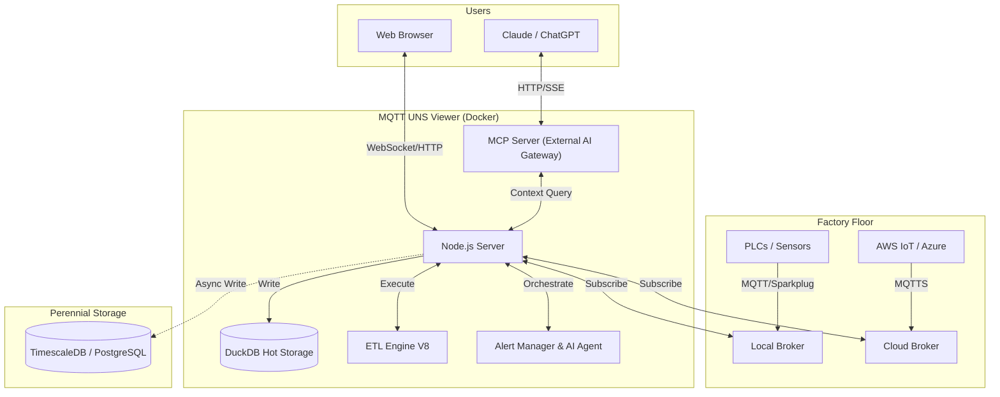

# MQTT UNS Viewer

<div align="center">


**The Open-Source Unified Namespace Explorer for the AI Era**

[Live Demo](https://www.mqttunsviewer.com) • [Architecture](#-architecture--design) • [Installation](#-installation--deployment) • [User Manual](#-user-manual) • [Developer Guide](#-developer-guide) • [API](#-api-reference)

</div>

---

### 📺 Watch the Demo

[](https://youtu.be/aOudy4su9F0)

---

## 📖 The Vision: Why UNS? Why Now?

### The Unified Namespace (UNS) Concept
The **Unified Namespace** is the single source of truth for your industrial data. It creates a semantic hierarchy (e.g., `Enterprise/Site/Area/Line/Cell`) where every smart device, software, and sensor publishes its state in real-time.

* **Single Source of Truth:** No more point-to-point spaghetti integrations.
* **Event-Driven:** Real-time data flows instead of batch processing.
* **Open Architecture:** Based on lightweight, open standards (MQTT, Sparkplug B).

> 📚 **Learn More:**
> * [What is UNS? (HiveMQ Blog)](https://www.hivemq.com/blog/unified-namespace-iiot-architecture/)
> * [Walker Reynolds on UNS (YouTube)](https://www.youtube.com/watch?v=6xHpw9YBYIQ)

### The AI Revolution & Gradual Adoption
In the age of **Generative AI** and **Large Language Models (LLMs)**, context is king. An AI cannot optimize a factory if the data is locked in silos with obscure names like `PLC_1_Tag_404`.

**MQTT UNS Viewer** facilitates **Gradual Adoption**:
1.  **Connect** to your existing messy brokers.
2.  **Visualize** the chaos.
3.  **Structure** it using the built-in **Mapper (ETL)** to normalize data into a clean UNS structure without changing the PLC code.
4.  **Analyze** with the **Autonomous AI Agent** which monitors alerts, investigates root causes using available tools, and generates reports automatically.

---

## 🏗 Architecture & Design

This application is designed for **Edge Deployment** (on-premise servers, industrial PCs). It prioritizes low latency, low footprint, and high versatility.

### Component Diagram



### Storage Strategy (Tiered)
1.  **Tier 1: In-Memory (Real-Time):** Instant WebSocket broadcasting for live dashboards.
2.  **Tier 2: Embedded OLAP (DuckDB):** * Stores "Hot Data" (e.g., last 24h).
    * Performs regex searches and aggregations in milliseconds.
    * Auto-pruning prevents disk overflow (`DUCKDB_MAX_SIZE_MB`).
3.  **Tier 3: Perennial (TimescaleDB):**
    * Optional connector.
    * "Fire-and-forget" ingestion for long-term archival and compliance.

---

## 🐳 Installation & Deployment

### Prerequisites
* Docker & Docker Compose
* Access to MQTT Broker(s)

### 1. Quick Start
```bash
# Clone the repository
git clone https://github.com/slalaure/mqtt_uns_viewer.git
cd mqtt_uns_viewer

# Setup configuration
cp .env.example .env

# Start the stack
docker-compose up -d
```
* **Dashboard:** `http://localhost:8080`
* **MCP Endpoint:** `http://localhost:3000/mcp`

### 2. Configuration (`.env`)

The application supports extensive configuration via environment variables.

#### Connectivity
```bash
# Define multiple brokers (Minified JSON)
MQTT_BROKERS='[{ "id":"local", "host":"mosquitto", "port":1883, "protocol":"mqtt", "subscribe":["#"], "publish":[] }, { "id":"cloud", "host":"aws-iot.com", "port":8883, "protocol":"mqtts", "certFilename":"cert.pem", "keyFilename":"key.pem", "caFilename":"root.pem" }]'
```

#### Storage Tuning
```bash
DUCKDB_MAX_SIZE_MB=500       # Limit local DB size. Oldest data is pruned automatically.
DUCKDB_PRUNE_CHUNK_SIZE=5000 # Number of rows to delete per prune cycle.
DB_INSERT_BATCH_SIZE=5000    # Messages buffered in RAM before DB write (Higher = Better Perf).
DB_BATCH_INTERVAL_MS=2000    # Flush interval for DB writes.

# Perennial Storage (Optional)
PERENNIAL_DRIVER=timescale   # Enable long-term storage (Options: 'none', 'timescale')
PG_HOST=192.168.1.50         # Postgres connection details
PG_DATABASE=mqtt_uns_viewer
PG_TABLE_NAME=mqtt_events
```

#### Authentication & Security
```bash
# Web Interface & API Authentication
HTTP_USER=admin              # Basic Auth User (Legacy/API fallback)
HTTP_PASSWORD=secure         # Basic Auth Password
SESSION_SECRET=change_me     # Signing key for session cookies

# Google OAuth (Optional)
GOOGLE_CLIENT_ID=...
GOOGLE_CLIENT_SECRET=...
PUBLIC_URL=http://localhost:8080 # Required for OAuth redirects

# Auto-Provisioning
ADMIN_USERNAME=admin         # Creates/Updates a Super Admin on startup
ADMIN_PASSWORD=admin
```

#### AI & MCP Capabilities
Control what the AI Agent is allowed to do.
```bash
MCP_API_KEY=sk-my-secret-key    # Secure the MCP endpoint
LLM_API_URL=...                 # OpenAI-compatible endpoint (Gemini, ChatGPT, Local)
LLM_API_KEY=...                 # Key for the internal Chat Assistant

# Granular Tool Permissions (true/false)
LLM_TOOL_ENABLE_READ=true       # Inspect DB, topics list, history, and search
LLM_TOOL_ENABLE_SEMANTIC=true   # Infer Schema, Model Definitions
LLM_TOOL_ENABLE_PUBLISH=true    # Publish MQTT messages
LLM_TOOL_ENABLE_FILES=true      # Read/Write files (SVGs, Simulators)
LLM_TOOL_ENABLE_SIMULATOR=true  # Start/Stop built-in sims
LLM_TOOL_ENABLE_MAPPER=true     # Modify ETL rules
LLM_TOOL_ENABLE_ADMIN=true      # Prune History, Restart Server
```

#### Analytics
```bash
ANALYTICS_ENABLED=false         # Enable Microsoft Clarity tracking
```

---

## 📘 User Manual

### 1. Authentication & Roles
The viewer supports **Local** (Username/Password) and **Google OAuth** authentication.
* **Standard User:** Can view data, create *Private* Charts, Mappers, and SVG views (stored in their own session workspace).
* **Administrator:** Has full control. Can edit *Global* configurations, access the **Admin Dashboard** (`/admin`), manage users, and configure the server via the UI.

### 2. Dynamic Topic Tree
The left panel displays the discovered UNS hierarchy.
* **Sparkplug B Support:** Topics starting with `spBv1.0/` are automatically decoded from Protobuf.
* **Multi-Broker:** The root nodes represent your different broker connections.

### 3. SVG Synoptics (SCADA View)
Create professional HMIs using standard vector graphics.
* **Dynamic Loading:** Upload `.svg` files directly via the UI or AI.
* **Layered Storage:**
    * **Global:** Files in `/data` are visible to everyone. (Admin write access).
    * **Private:** Users can create/upload SVGs visible only to them (saved in `/data/sessions/<id>/svgs`).

### 4. Historical Analysis & Data Management
Navigate through time using the **DuckDB** powered engine.
* **Time Travel:** Use the dual-handle slider or quick-select buttons (1h, 24h, Full).
* **Export:** Download filtered data as JSON for offline analysis.
* **Import:** Admins can import JSON history files to backfill the database.
* **Pruning:** Right-click a topic node or use the Admin tools to delete specific topic patterns from the database to free up space.

### 5. Mapper (ETL Engine)
Transform data on the fly using JavaScript.
* **Layered Config:**
    * **Live/Global:** Rules running on the server. Only Admins can "Save Live".
    * **Private Drafts:** Users can "Save As New" to create personal versions of mapping logic.
* **Features:** Supports Multi-target routing (Fan-out) and re-publishing to different brokers.

### 6. Advanced Charting
Visualize correlations instantly.
* **Smart Axis:** Automatically groups variables with similar units (e.g., Temperature, Pressure) on shared Y-axes.
* **Persistence:** Save chart configurations (Global for Admins, Private for Users).

### 7. AI Chat Assistant & Autonomous Alerts
A floating assistant powered by LLMs.
* **Context Aware:** Knows your topics, schemas, and file structure.
* **Multi-Session:** Use the **☰** menu to switch between chat sessions, create new ones, or delete old ones.
* **Capabilities:** Can generate SQL queries, analyze anomalies, creating SVG dashboards from scratch (`create_dynamic_view`), and even control simulators.
* **Vision:** Supports camera capture for analyzing physical equipment.

### 8. Intelligent Alerting (New!)
Define sophisticated detection rules using JavaScript conditions.
* **Autonomous Analyst:** When an alert triggers, the built-in **AI Agent** wakes up. It autonomously performs an investigation (up to 10 iterations) using tools like `get_topic_history` or `search_data` to understand the root cause.
* **Reporting:** The AI generates a Markdown summary of the incident, which is displayed in the dashboard and sent via Webhook (Slack/Teams/Google Chat).
* **Tool Exposure:** Alert management is now fully exposed to the AI, allowing it to list, create, and acknowledge alerts via chat.

### 9. Configuration Interface (Admin Only)
Accessible via the Cog icon (`/config.html`).
* **Environment:** Modify `.env` variables and restart the server from the UI.
* **Certificates:** Upload SSL/TLS certificates for MQTT connections.
* **UNS Model:** Edit the semantic model (`uns_model.json`) used by the AI for search.
* **Database:** Execute Full Reset (Truncate) or Import data.

---

## 👨‍💻 Developer Guide

### Project Structure
```text
📦 root
 ┣ 📂 data/                # Persistent Volume (Global Configs)
 ┃ ┣ 📂 certs/             # MQTT Certificates
 ┃ ┣ 📂 sessions/          # User Data (Private Charts/SVGs/History/Chats)
 ┃ ┣ 📄 charts.json        # Global Saved Charts
 ┃ ┣ 📄 mappings.json      # Global ETL Rules
 ┃ ┣ 📄 uns_model.json     # Semantic Model Definition
 ┃ ┗ 📄 mqtt_events.duckdb # Hot DB
 ┣ 📂 database/            # DB Adapters (DuckDB, Timescale, UserManager)
 ┣ 📂 public/              # Frontend (Vanilla JS SPA)
 ┣ 📂 routes/              # Express API (Auth, Admin, Config, Chat, etc.)
 ┣ 📄 server.js            # Main Entry Point
 ┣ 📄 alert_manager.js     # AI-Powered Alert Engine
 ┣ 📄 mcp_server.mjs       # External AI Interface (Model Context Protocol)
 ┗ 📄 mapper_engine.js     # ETL Sandbox
```

### SVG Scripting API
To add logic (animations, color changes) to an SVG, create a file named `[filename].svg.js` alongside your `.svg` file.

```javascript
// data/factory.svg.js
window.registerSvgBindings({
    // Called on load
    initialize: (svgRoot) => {
        console.log("SVG Loaded");
    },
    // Called on EVERY message
    update: (brokerId, topic, payload, svgRoot) => {
        if (topic.includes('fan_speed')) {
            const fan = svgRoot.querySelector('#fan_blade');
            // Rotate based on payload value
            const speed = payload.value || 0;
            fan.style.transform = `rotate(${Date.now() % 360}deg)`;
            fan.style.animationDuration = `${1000/speed}ms`;
        }
        if (topic.includes('status')) {
             const rect = svgRoot.querySelector('#status_box');
             rect.setAttribute('fill', payload.active ? 'green' : 'red');
        }
    },
    // Called when resetting view
    reset: (svgRoot) => { }
});
```

### Mapper Engine (ETL)
The Mapper runs inside a Node.js `vm` sandbox. You have access to:
* `msg`: The incoming MQTT message (`topic`, `payload`, `brokerId`).
* `db`: Read-only access to DuckDB (`await db.all(sql)`).

**Advanced Example: calculating a moving average**
```javascript
// Calculate average of last 10 readings before publishing
const history = await db.all(`
    SELECT CAST(payload->>'value' AS FLOAT) as val 
    FROM mqtt_events 
    WHERE topic = '${msg.topic}' 
    ORDER BY timestamp DESC LIMIT 10
`);

const sum = history.reduce((a, b) => a + b.val, 0) + msg.payload.value;
const avg = sum / (history.length + 1);

return {
    ...msg,
    payload: {
        current: msg.payload.value,
        moving_avg: avg,
        timestamp: new Date().toISOString()
    }
};
```

### Custom Simulators
Create a file `data/simulator-myplant.js`. It will be automatically loaded on restart.

```javascript
module.exports = (logger, publish, isSparkplug) => {
    let interval;
    return {
        start: () => {
            interval = setInterval(() => {
                const payload = JSON.stringify({ temp: Math.random() * 100 });
                publish('factory/line1/sensor', payload, false);
            }, 1000);
        },
        stop: () => clearInterval(interval)
    };
};
```

---

## 🧠 AI Integration (Model Context Protocol)

The **MCP Server** allows you to connect AI Agents (like **Claude Desktop**) directly to your factory floor data context.

**Capabilities Exposed to AI:**
* `get_topics_list`: Discover what machines are online.
* `search_uns_concept`: "Find all machines with a 'Temperature' metric > 50".
* `infer_schema`: "Give me the JSON schema for the ERP work orders".
* `get_topic_history`: "Analyze the last hour of data for anomalies".
* `publish_message`: "Turn on the warning light".
* **New! Alert Management:**
    * `list_active_alerts`: See current issues.
    * `create_alert_rule`: Define new detection logic.
    * `update_alert_status`: Acknowledge or resolve alerts.

**Client Config (Claude Desktop `config.json`):**
```json
{
  "mcpServers": {
    "mqtt_viewer": {
      "command": "node",
      "args": ["path/to/mcp-client.js"], // Or via Docker
      "env": {
        "MCP_API_KEY": "your-key",
        "MCP_URL": "http://localhost:3000/mcp"
      }
    }
  }
}
```

---

## 🔌 API Reference

The application exposes a comprehensive REST API.

| Method | Endpoint | Description | Auth Required |
| :--- | :--- | :--- | :--- |
| `POST` | `/api/external/publish` | Publish data from 3rd party apps. Requires `x-api-key`. | ✅ (API Key) |
| `GET` | `/api/context/status` | Get DB size and connection status. | ✅ (Session/Basic) |
| `POST` | `/api/publish/message` | Publish MQTT message. | ✅ (Session/Basic) |
| `GET` | `/api/chat/sessions` | List chat history sessions. | ✅ (Session/Basic) |
| `GET` | `/api/chat/session/:id` | Load specific session history. | ✅ (Session/Basic) |
| `DELETE` | `/api/chat/session/:id` | Delete a chat session. | ✅ (Session/Basic) |
| `POST` | `/api/chat/stop` | Abort current generation. | ✅ (Session/Basic) |
| `POST` | `/api/external/publish` | Publish data from 3rd party apps. | ✅ (API Key) |
| `POST` | `/api/chat/completion` | Streamed LLM completion with Tools. | ✅ (Session/Basic) |
| `GET` | `/api/alerts/active` | List triggered alerts. | ✅ (Session/Basic) |
| `POST` | `/api/alerts/rules` | Create a new alert rule. | ✅ (Session/Basic) |
| `POST` | `/api/alerts/:id/status` | Acknowledge/Resolve an alert. | ✅ (Session/Basic) |
| `GET` | `/api/admin/users` | List registered users. | ✅ (Admin) |
| `POST` | `/api/env/restart` | Restart the application server. | ✅ (Admin) |
| `POST` | `/api/env/import-db` | Import JSON history data. | ✅ (Admin) |

---

## 🤝 Contributing

We welcome contributions! We believe in **Community Driven Innovation**.

1.  **Fork** the repository.
2.  **Create** a feature branch (`git checkout -b feature/AmazingFeature`).
3.  **Commit** your changes (English commit messages please).
4.  **Push** to the branch.
5.  **Open a Pull Request**.

---

## 🛡 License

Licensed under the **Apache License, Version 2.0**.
You are free to use, modify, and distribute this software, even for commercial purposes, under the terms of the license.

**Copyright (c) 2025-2026 Sebastien Lalaurette**