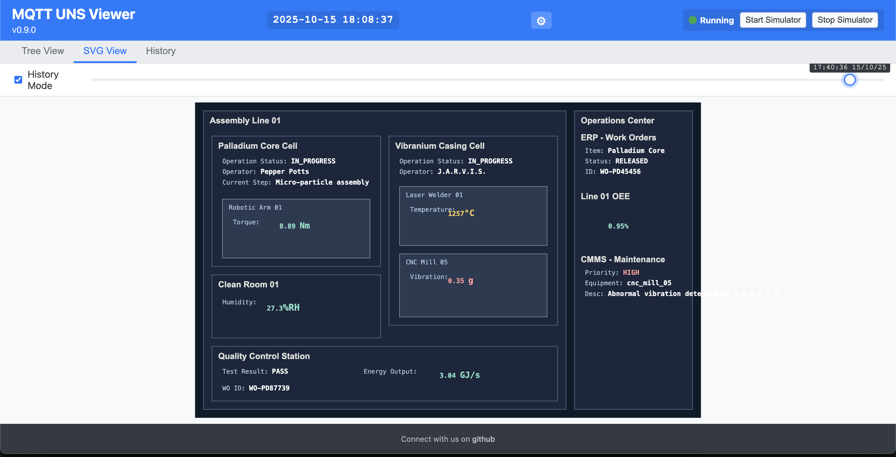

# MQTT UNS Viewer

A lightweight, real-time web application to visualize MQTT topic trees and dynamic SVG graphics based on Unified Namespace (UNS) messages. This project is fully containerized with Docker and includes a powerful data simulator and a dedicated **Model Context Protocol (MCP) Server** for seamless integration with AI agents.




---

## Core Features

-   **Real-Time Topic Tree:** Automatically builds a hierarchical tree of all received MQTT topics.
-   **Dynamic SVG View:** Updates a custom 2D plan in real-time. Includes a "History Mode" to replay the visual state of the system at any point in time.
-   **AI Agent Integration:** A dedicated MCP Server exposes application controls and data as structured tools for Large Language Model (LLM) agents.
-   **Web-Based Configuration:** A built-in configuration page allows for easy updates to all server settings.
-   **Persistent Message History:** Stores all MQTT messages in a local **DuckDB** database that persists across restarts.
-   **Advanced History Filtering:** The history view features keyword search (with highlighting) and a dual-handle time-range slider.
-   **Containerized:** Runs in a Docker container for simple, one-command deployment.

---

## Architecture

The application runs as a single Docker container that internally manages two Node.js processes:

1.  **Web Server (`server.js`):** The core application.
    -   Connects to the MQTT broker.
    -   Serves the frontend web application and the configuration API.
    -   Broadcasts MQTT messages to the UI via WebSockets.
    -   Manages the DuckDB database.
    -   Launches and manages the MCP Server as a child process.

2.  **MCP Server (`mcp_server.js`):** The AI Agent interface.
    -   Defines structured tools for an LLM to interact with the application.
    -   Communicates with the Web Server via its internal REST API.

**Data Persistence** is achieved by mounting a local `data` directory as a Docker volume. This ensures that your configuration, SVG plan, and database are saved on your host machine.

---

## Getting Started with Docker

This is the recommended way to run the application.

### Prerequisites

-   [Docker](https://www.docker.com/get-started) and [Docker Compose](https://docs.docker.com/compose/install/) must be installed.

### First-Time Setup

1.  **Clone the Repository:**
    ```bash
    git clone [https://github.com/slalaure/mqtt_uns_viewer.git](https://github.com/slalaure/mqtt_uns_viewer.git)
    cd mqtt_uns_viewer
    ```

2.  **Prepare the Data Directory:**
    The application reads all user-specific files from a `data` directory.
    -   **Configuration:** Copy the example config file into the `data` directory: `cp .env.example data/.env`.
    -   **SVG Plan:** Place your custom `view.svg` file inside the `data` directory. An example is already there.
    -   **(Optional) Certificates:** If using MTLS, place your `certs` folder inside the `data` directory.

3.  **Edit Your Configuration:**
    Open `data/.env` with a text editor and fill in your MQTT broker details.

### Running the Application

Build and run the container with a single command:

```bash
docker-compose up --build
```

The application will now be available at http://localhost:8080.

To run in the background, use 
```bash
docker-compose up --build -d
```

Of course. Here is the last part of the README.md file formatted as a raw Markdown block that you can copy and paste directly.

Markdown

---

## Configuration & Customization

### Web Configuration

Navigate to **http://localhost:8080/config.html** to access the web-based configuration editor.

-   All settings from your `data/.env` file are displayed here.
-   After saving, you will be prompted to restart the server. If you confirm, the Docker container will gracefully restart to apply the new settings.

### Customizing the SVG Plan

1.  **Edit the SVG File:** Modify the `data/view.svg` file in a vector editor (like Inkscape) or a text editor.
2.  **Link Topics to Zones:** To link an MQTT topic to an area, create a group `<g>` element. The `id` of the group **must** match the MQTT topic, with slashes (`/`) replaced by dashes (`-`).
    -   **Topic:** `stark_industries/malibu_facility/lab/zone-a`
    -   **SVG Group ID:** `<g id="stark_industries-malibu_facility-lab-zone-a">`
3.  **Link Payload to Text:** To display a value from a JSON payload, add a `data-key` attribute to any `<tspan>` or `<text>` element inside the corresponding group.
    -   **Payload:** `{"temperature": 21.5, "status": "Nominal"}`
    -   **SVG Code:**
        ```xml
        <g id="stark_industries-malibu_facility-lab-zone-a">
            <text>Temp: <tspan data-key="temperature">--</tspan> °C</text>
        </g>
        ```

---

## License

This project is licensed under the MIT License. See the `LICENSE` file for details.