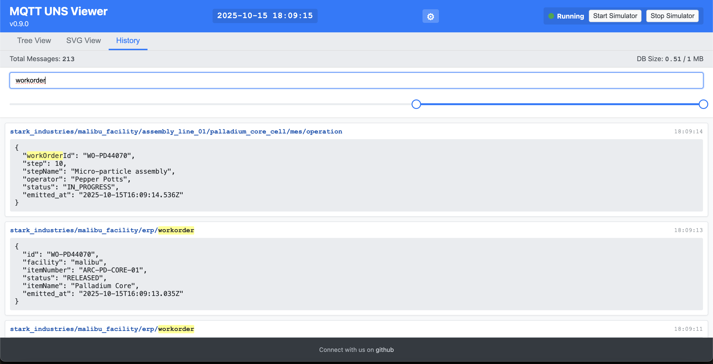

# MQTT UNS Viewer

<div align="center">


** The Open-Source Unified Namespace Explorer for the AI Era **

[Live Demo](https://www.mqttunsviewer.com) • [Architecture](#-architecture--design) • [Installation](#-installation--deployment) • [User Manual](#-user-manual) • [Developer Guide](#-developer-guide) • [API](#-api-reference)

</div>

---

### 📺 Watch the Demo

[](https://youtu.be/aOudy4su9F0)

---

## 📖 The Vision: Why UNS? Why Now?

### The Unified Namespace (UNS) Concept
The **Unified Namespace** is the single source of truth for your industrial data. It creates a semantic hierarchy (e.g., `Enterprise/Site/Area/Line/Cell`) where every smart device, software, and sensor publishes its state in real-time.

* **Single Source of Truth:** No more point-to-point spaghetti integrations.
* **Event-Driven:** Real-time data flows instead of batch processing.
* **Open Architecture:** Based on lightweight, open standards (MQTT, Sparkplug B).

> 📚 **Learn More:**
> * [What is UNS? (HiveMQ Blog)](https://www.hivemq.com/blog/unified-namespace-iiot-architecture/)
> * [Walker Reynolds on UNS (YouTube)](https://www.youtube.com/watch?v=6xHpw9YBYIQ)

### The AI Revolution & Gradual Adoption
In the age of **Generative AI** and **Large Language Models (LLMs)**, context is king. An AI cannot optimize a factory if the data is locked in silos with obscure names like `PLC_1_Tag_404`.

**MQTT UNS Viewer** facilitates **Gradual Adoption**:
1.  **Connect** to your existing messy brokers.
2.  **Visualize** the chaos.
3.  **Structure** it using the built-in **Mapper (ETL)** to normalize data into a clean UNS structure without changing the PLC code.
4.  **Feed AI** via the **MCP Server**, allowing agents to query "What is the OEE of Line 1?" instead of parsing raw logs.

---

## 🏗 Architecture & Design

This application is designed for **Edge Deployment** (on-premise servers, industrial PCs). It prioritizes low latency, low footprint, and high versatility.

### Component Diagram


### Storage Strategy (Tiered)
1.  **Tier 1: In-Memory (Real-Time):** Instant WebSocket broadcasting for live dashboards.
2.  **Tier 2: Embedded OLAP (DuckDB):** * Stores "Hot Data" (e.g., last 24h).
    * Performs regex searches and aggregations in milliseconds.
    * Auto-pruning prevents disk overflow (`DUCKDB_MAX_SIZE_MB`).
3.  **Tier 3: Perennial (TimescaleDB):**
    * Optional connector.
    * "Fire-and-forget" ingestion for long-term archival and compliance.

---

## 🐳 Installation & Deployment

### Prerequisites
* Docker & Docker Compose
* Access to MQTT Broker(s)

### 1. Quick Start
```bash
# Clone the repository
git clone https://github.com/slalaure/mqtt_uns_viewer.git
cd mqtt_uns_viewer

# Setup configuration
cp .env.example .env

# Start the stack
docker-compose up -d
```
* **Dashboard:** `http://localhost:8080`
* **MCP Endpoint:** `http://localhost:3000/mcp`

### 2. Configuration (`.env`)

#### Connectivity
```bash
# Define multiple brokers (Minified JSON)
MQTT_BROKERS='[{"id":"local","host":"mosquitto","port":1883,"protocol":"mqtt","subscribe":["#"],"publish":[]},{"id":"cloud","host":"aws-iot.com","port":8883,"protocol":"mqtts","certFilename":"cert.pem","keyFilename":"key.pem","caFilename":"root.pem"}]'
```

#### Storage Tuning
```bash
DUCKDB_MAX_SIZE_MB=500       # Limit local DB size
DB_INSERT_BATCH_SIZE=5000    # Performance tuning for high-throughput
PERENNIAL_DRIVER=timescale   # Enable long-term storage
PG_HOST=192.168.1.50         # Postgres connection details
```

#### Security & AI
```bash
HTTP_USER=admin              # Basic Auth User
HTTP_PASSWORD=secure         # Basic Auth Password
MCP_API_KEY=sk-my-secret-key # Protect AI Access
EXTERNAL_API_ENABLED=true    # Allow HTTP Publish
```

---

## 📘 User Manual

### 1. Dynamic Topic Tree
The left panel displays the discovered UNS hierarchy.
* **Sparkplug B Support:** Topics starting with `spBv1.0/` are automatically decoded from Protobuf. The tree renders complex metrics, aliases, and historical rebirths (`NBIRTH`).
* **Multi-Broker:** The root nodes represent your different broker connections (e.g., `[local]`, `[aws]`).


### 2. SVG Synoptics (SCADA View)
Create professional HMIs using standard vector graphics.
1.  **Upload:** Drop your `.svg` file in the `data/` folder.
2.  **Simple Binding:** Set an SVG element's `id` to match a topic (replace `/` with `-`).
    * *Example:* Topic `plant/line1/temp` -> SVG ID `plant-line1-temp`.
3.  **Advanced Scripting:** See the [Developer Guide](#svg-scripting-api) below.



### 3. Historical Analysis
Navigate through time using the **DuckDB** powered engine.
* **Global Search:** Type "Error" or "Voltage" to find any message containing these terms in the topic *or* the payload.
* **Time Travel:** Use the dual-handle slider at the bottom to restrict the view to a specific incident window.
* **Pruning:** Right-click (or use the modal) to delete specific topic patterns from history to free up space.


### 4. Mapper (ETL Engine)
Transform data on the fly.
* **Scenario:** You have a sensor sending `{ "tempF": 100 }` but your UNS requires `{ "tempC": 37.7 }`.
* **Action:** Create a mapping rule.
* **Result:** The Viewer publishes the transformed message to the target topic/broker automatically.


### 5. Advanced Charting
Visualize correlations instantly.
1.  Select a topic in the Chart Tree.
2.  Check the metrics you want to plot (supports nested JSON).
3.  Click **Save As...** to persist your configuration in `charts.json`.
4.  **Export:** Download data as CSV for Excel or PNG for reports.


### 6. Data Publishing & Simulation
Manually publish messages to test your architecture or run built-in simulation scenarios (Stark Industries, Death Star, Paris Metro) to generate test data.


---

## 👨‍💻 Developer Guide

### Project Structure
```text
📦 root
 ┣ 📂 data/                # Persistent Volume
 ┃ ┣ 📂 certs/             # MQTT Certificates
 ┃ ┣ 📄 charts.json        # Saved Charts
 ┃ ┣ 📄 mappings.json      # ETL Rules
 ┃ ┣ 📄 mqtt_events.duckdb # Hot DB
 ┃ ┗ 📄 [name].svg.js      # SVG Logic
 ┣ 📂 database/            # DB Adapters
 ┣ 📂 public/              # Frontend (Vanilla JS)
 ┣ 📂 routes/              # Express API
 ┣ 📄 server.js            # Main Entry
 ┣ 📄 mcp_server.mjs       # AI Server
 ┗ 📄 mapper_engine.js     # ETL Sandbox
```

### SVG Scripting API
To add logic (animations, color changes) to an SVG, create a file named `[filename].svg.js` in the `data/` folder.

```javascript
// data/factory.svg.js
window.registerSvgBindings({
    // Called on load
    initialize: (svgRoot) => {
        console.log("SVG Loaded");
    },
    // Called on EVERY message
    update: (brokerId, topic, payload, svgRoot) => {
        if (topic.includes('fan_speed')) {
            const fan = svgRoot.querySelector('#fan_blade');
            // Rotate based on payload value
            const speed = payload.value || 0;
            fan.style.transform = `rotate(${Date.now() % 360}deg)`;
            fan.style.animationDuration = `${1000/speed}ms`;
        }
        if (topic.includes('status')) {
             const rect = svgRoot.querySelector('#status_box');
             rect.setAttribute('fill', payload.active ? 'green' : 'red');
        }
    },
    // Called when resetting view
    reset: (svgRoot) => { }
});
```

### Mapper Engine (ETL)
The Mapper runs inside a Node.js `vm` sandbox. You have access to:
* `msg`: The incoming MQTT message (`topic`, `payload`, `brokerId`).
* `db`: Read-only access to DuckDB (`await db.all(sql)`).

**Advanced Example: calculating a moving average**
```javascript
// Calculate average of last 10 readings before publishing
const history = await db.all(`
    SELECT CAST(payload->>'value' AS FLOAT) as val 
    FROM mqtt_events 
    WHERE topic = '${msg.topic}' 
    ORDER BY timestamp DESC LIMIT 10
`);

const sum = history.reduce((a, b) => a + b.val, 0) + msg.payload.value;
const avg = sum / (history.length + 1);

return {
    ...msg,
    payload: {
        current: msg.payload.value,
        moving_avg: avg,
        timestamp: new Date().toISOString()
    }
};
```

### Custom Simulators
Create a file `data/simulator-myplant.js`. It will be automatically loaded on restart.

```javascript
module.exports = (logger, publish, isSparkplug) => {
    let interval;
    return {
        start: () => {
            interval = setInterval(() => {
                const payload = JSON.stringify({ temp: Math.random() * 100 });
                publish('factory/line1/sensor', payload, false);
            }, 1000);
        },
        stop: () => clearInterval(interval)
    };
};
```

---

## 🧠 AI Integration (Model Context Protocol)

The **MCP Server** allows you to connect AI Agents (like **Claude Desktop**) directly to your factory floor data context.

**Capabilities Exposed to AI:**
* `get_topics_list`: Discover what machines are online.
* `search_uns_concept`: "Find all machines with a 'Temperature' metric > 50".
* `infer_schema`: "Give me the JSON schema for the ERP work orders".
* `get_topic_history`: "Analyze the last hour of data for anomalies".
* `publish_message`: "Turn on the warning light".

**Client Config (Claude Desktop `config.json`):**
```json
{
  "mcpServers": {
    "mqtt_viewer": {
      "command": "node",
      "args": ["path/to/mcp-client.js"],
      "env": {
        "MCP_API_KEY": "your-key",
        "MCP_URL": "http://localhost:3000/mcp"
      }
    }
  }
}
```

---

## 🔌 API Reference

The application exposes a comprehensive REST API.

| Method | Endpoint | Description | Auth Required |
| :--- | :--- | :--- | :--- |
| `POST` | `/api/external/publish` | Publish data from 3rd party apps. Requires `x-api-key`. | ✅ (API Key) |
| `GET` | `/api/context/status` | Get DB size and connection status. | ✅ (Basic) |
| `GET` | `/api/context/search` | Full-text search (`?q=keyword`). | ✅ (Basic) |
| `POST` | `/api/simulator/start/:name` | Start a simulation scenario. | ✅ (Basic) |
| `GET` | `/api/chart/config` | Retrieve saved chart configurations. | ✅ (Basic) |

---

## 🤝 Contributing

We welcome contributions! We believe in **Community Driven Innovation**.

1.  **Fork** the repository.
2.  **Create** a feature branch (`git checkout -b feature/AmazingFeature`).
3.  **Commit** your changes (English commit messages please).
4.  **Push** to the branch.
5.  **Open a Pull Request**.

---

## 🛡 License

Licensed under the **Apache License, Version 2.0**.
You are free to use, modify, and distribute this software, even for commercial purposes, under the terms of the license.

**Copyright (c) 2025 Sebastien Lalaurette**